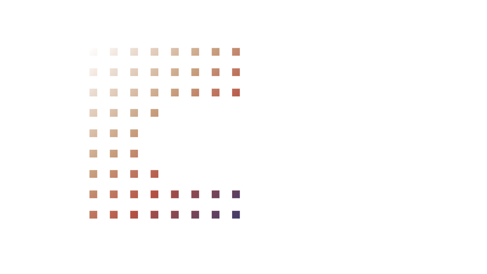

# Ébeli - Premium LED Lighting B2B Platform

<p align="center">
  <a href="https://ebelive.com" target="_blank">
    
  </a>
</p>

<p align="center">
  <strong>Transforming spaces with light through innovation and efficiency.</strong>
</p>

<p align="center">
  <a href="https://ebelive.com" target="_blank">🌐 Live Website</a>
  •
  <a href="https://wa.me/584242280730" target="_blank">📱 WhatsApp</a>
  •
  <a href="https://instagram.com/ebeli_ve" target="_blank">📸 Instagram</a>
</p>

---

## 🏢 About the Project

Ébeli is a **B2B platform** for distribution of premium LED lighting solutions in Venezuela. We combine Japanese technology, ISO 9001 certifications, and a robust distribution network to serve businesses nationwide.

Our platform enables:

- **Product catalog browsing** with category filtering
- **Interactive distributor map** for nationwide coverage
- **B2B communication** via WhatsApp integration
- **Social media integration** with Instagram feed

---

## 🛠️ Tech Stack

| Technology                               | Purpose          |
| ---------------------------------------- | ---------------- |
| [Astro 6.1.8](https://astro.build)       | Framework        |
| [TypeScript](https://typescriptlang.org) | Language         |
| [Tailwind CSS](https://tailwindcss.com)  | Styling          |
| [Vercel](https://vercel.com)             | Deployment       |
| [Behold.so](https://behold.so)           | Instagram Widget |

---

## 📂 Project Structure

```plaintext
src/
├── components/
│   ├── sections/
│   │   ├── landing/       # Landing page sections
│   │   ├── navbar&footer/ # Navigation & Footer
│   │   └── misc/          # Miscellaneous components
│   └── ui/
│       ├── cards/         # Product cards
│       └── forms/         # Form components
├── content/
│   └── products/          # Product data (Astro collections)
├── data/
│   └── constants.ts       # Site constants
├── images/
│   ├── productos/         # Product images
│   └── certificados/      # Certification badges
├── layouts/
│   └── MainLayout.astro   # Main application layout
├── pages/
│   ├── products/          # Product catalog pages
│   ├── ubicarnos.astro    # Distributor map page
│   ├── contact.astro      # Contact page
│   ├── distribuidor.astro # Distributor registration
│   └── index.astro        # Homepage
├── styles/
│   └── reveal.css         # Scroll reveal animations
└── env.d.ts               # TypeScript environment declarations
```

---

## 🚀 Getting Started

### Prerequisites

- Node.js 18.14.1 or higher
- npm or pnpm

### Installation

```bash
# Clone the repository
git clone https://github.com/ungardev/ebeli.git
cd ebeli

# Install dependencies
npm install

# Start development server
npm run dev

# Build for production
npm run build

# Preview production build
npm run preview
```

---

## 🌟 Features

### ✅ Implemented

- **Responsive Design** - Mobile-first approach with desktop optimization
- **Product Catalog** - 20+ products across 6 categories (bulbs, lamps, tubes, reflectors, LED strips, panels)
- **Interactive Map** - SVG-based Venezuela map with state filtering
- **Distributor Table** - Sortable and filterable distributor/client data
- **Instagram Feed** - Live Instagram integration via Behold.so widget
- **WhatsApp Integration** - Direct B2B communication channel
- **SEO Optimization** - Meta tags, sitemap, and structured data
- **Scroll Reveal Animations** - Smooth entrance animations
- **Counter Animation** - Animated statistics section
- **FAQ Accordion** - Expandable questions for B2B inquiries
- **Contact Form** - WhatsApp and email contact options
- **Dark Mode Design** - Premium luxury aesthetic

### 📦 Product Categories

| Category    | Description                                        |
| ----------- | -------------------------------------------------- |
| Bombillos   | LED Bulbs (Classic, Dome, Dicroic, Lipstick, Vela) |
| Lámparas    | Recessed and surface-mounted lamps                 |
| Tubos       | LED Tubes                                          |
| Reflectores | Floodlights and spotlights                         |
| Cintas LED  | LED Strip lighting                                 |
| Paneles     | LED Panel lights                                   |

---

## 🏗️ Deployment

The project is deployed on **Vercel** with the following configurations:

- **Build Command:** `npm run build`
- **Output Directory:** `dist`
- **Install Command:** `npm install`
- **Framework Preset:** Astro

### Content Security Policy

The `vercel.json` includes strict CSP headers for security:

```json
{
  "headers": [
    {
      "source": "/(.*)",
      "headers": [
        {
          "key": "Content-Security-Policy",
          "value": "default-src 'self'; script-src 'self' 'unsafe-inline' https://unpkg.com https://w.behold.so; ..."
        }
      ]
    }
  ]
}
```

---

## 📊 Statistics

- **20+** Premium LED products
- **6** Product categories
- **24** States covered in Venezuela
- **2** Years warranty on all products
- **ISO 9001** Certified quality
- **Japanese Technology** in all components

---

## 🤝 Business Model

Ébeli operates as a **B2B distributor** with a network of commercial allies:

- **Ferreterías** (Hardware stores)
- **Construction companies**
- **Commercial establishments**
- **Independent distributors**

### Key Business Features

- National dispatch and delivery
- Special conditions for wholesale distributors
- Agile restocking response (24-72 hours)
- 2-year warranty on all products

---

## 📝 License

This project is for demonstration purposes as part of a professional portfolio.

**MIT License** - See [LICENSE](LICENSE) file for details.

---

## 👨‍💻 Author

**Ungar Dev**

- GitHub: [@ungardev](https://github.com/ungardev)
- Website: [ebelive.com](https://ebelive.com)

---
